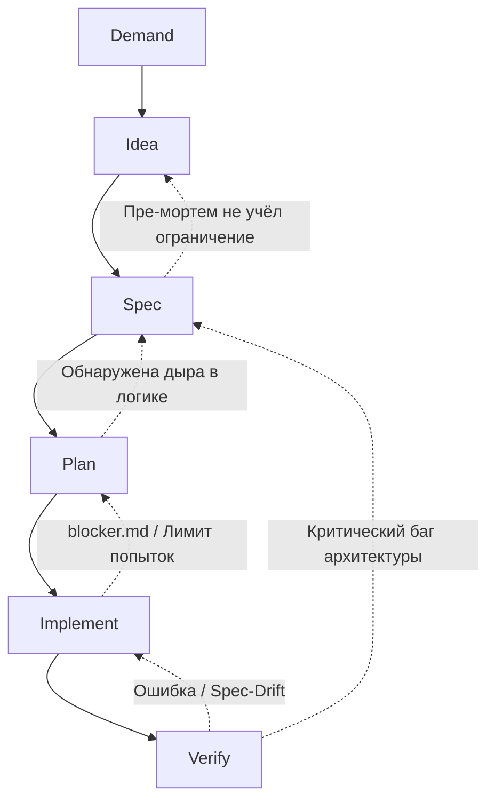

# DISPIV Engineering Pipeline

Данный документ описывает **DISPIV** — методологию Spec-Driven Development, основанную на широком взаимодействии человека с ИИ агентами. Процесс спроектирован так, чтобы максимизировать качество архитектуры и скорость внедрения изменений, при этом минимизируя расходы на ИИ.

Основа методологии: жесткое разделение этапов, строгая изоляция контекста для минимизации "когнитивной нагрузки" на ИИ-модели и использование системы "единого источника истины" (Source of Truth) на базе Markdown-документов.

## Верхнеуровневый обзор пайплайна

Пайплайн состоит из 6 последовательных этапов, разделяющих зоны ответственности между Человеком, Сильным ИИ ($AI_{strong}$) и Слабым ИИ ($AI_{weak}$).

- **Demand (Человек):** Формулирование бизнес-проблемы или потребности.
- **Idea (Человек + $AI_{strong}$):** Генерация концепций решения, проведение пре-мортем анализа и выбор единого вектора.
- **Spec (Человек + $AI_{strong}$):** Пошаговая итеративная разработка строгой спецификации. Написание скетч-тестов.
- **Plan ($AI_{strong}$):** Декомпозиция спецификации в гранулированный DAG-план по стратегии _Expand-Migrate-Contract_.
- **Implement ($AI_{weak}$ / Оркестратор):** Параллельное или последовательное выполнение атомарных задач непосредственно в кодовой базе.
- **Verify (Человек + Автоматика):** Финальная сборка, ручная проверка тестов и рантайм-валидация.

---

<b>Подробное описание этапов пайплайна</b>

### Этап 1: Demand (Спрос / Потребность)

- **Ответственный:** Человек.
- **Суть:** Фиксация проблемы в "сыром" виде. Технические решения на этом этапе не предлагаются.
- **Артефакт:** Тикет с описанием проблемы.

### Этап 2: Idea (Концептуализация)

- **Ответственный:** Человек + $AI_{strong}$.
- **Суть:** Мозговой штурм. Проводится pre-mortem анализ и другие техники. Выбирается одна оптимальная идея.
- **Артефакт:** Документ архитектурного решения с суффиксом `.adr.md`.

### Этап 3: Spec (Спецификация)

- **Ответственный:** Человек + $AI_{strong}$.
- **Суть:** Проектирование архитектуры и логики методом последовательного уточнения. Спецификация становится монолитным "источником истины".
- **Test Sketches:** Человек обязан написать скетч-тесты на естественном языке. Они необходимы для следующих этапов. Также это необходимо для усвоения Человеком спецификации и покрытия самых опасных сценариев еще до начала следующего этапа.
- **Разработка в Brownfield-проектах:** начинается не с полного реверс-инжиниринга всей базы, а точечно: спека пишется только для того модуля, который затрагивается инициативой.
- **Масштабирование и декомпозиция (Split limits):** Если идея требует масштабных изменений, спецификация декомпозируется на несколько файлов для предотвращения потери контекста LLM (Attention Drop). Спецификацию необходимо дробить, если срабатывает хотя бы одна эвристика:
  1. **Границы доменов:** Фича затрагивает разные слои с разным стеком.
  2. **Объем спецификации:** Размер `*.spec.md` превышает порог $S \ge 500$ строк.
  3. **Глубина пайплайна:** Прогнозируемое количество атомарных задач для реализации $N_{tasks} \ge 10$.
- **Артефакт:** Файлы с суффиксом `.spec.md`.

### Этап 4: Plan (Планирование)

- **Ответственный:** $AI_{strong}$.
- **Суть:** Трансляция одной спецификации в структурированный граф задач (DAG).
- **Стратегия Expand-Migrate-Contract (EMC):** Изменения разбиваются на безопасные фазы добавления, миграции и удаления, гарантируя Compile-Safe Ordering.
- **Артефакт:** `manifest.plan.md` и набор атомарных инструкций `task-X.md`.

### Этап 5: Implement (Реализация)

- **Ответственный:** $AI_{weak}$ / Автономный оркестратор агентов.
- **Суть:** Атомарные задачи из DAG поступают на исполнение агентам. Огромная экономия токенов при использовании чистого контекстного окна для выполнения каждой задачи и жесткой изоляции файлов, разрешенных к чтению/изменению.
  Оркестратор может быть реализован на базе стандартных пайплайнов CI/CD (например, GitHub Actions matrix или GitLab CI DAGs) или через LangGraph. Написание кастомного движка не требуется.
- **Обработка нештатных ситуаций:** Если $AI_{weak}$ находит неочевидный edge-case, он обязан прервать задачу и сгенерировать артефакт `blocker.md` для эскалации.
- **Артефакт:** Измененный рабочий каталог или Pull Request.

### Этап 6: Verify (Верификация)

- **Ответственный:** Автоматика (CI/CD) + Человек.
- **Суть:** Финальный барьер качества, Spec-Drift анализ через генерацию Markdown-отчета в CI.
- **Артефакт:** принятый Pull Request.

---

<b>Механизм обработки блокеров (Feedback Loops)</b>

Пайплайн предусматривает явные маршруты отката. ИИ агенты должны быть способны обнаружить блокер и при необходимости откатиться назад. В пайплайн заложен **механизм "Circuit Breaker"**: если количество попыток автоматического исправления $N \ge 3$, задача жестко блокируется и перенаправляется человеку и $AI_{strong}$.

- **Из Verify в Implement:** Падение тестов или срабатывание Spec-Drift. Возвращается лог.
- **Из Verify в Spec:** Обнаружение принципиальных архитектурных ошибок.
- **Из Implement в Plan:** Генерация `blocker.md` агентом (если задача неотделима) или срабатывание Circuit Breaker.
- **Из Plan в Spec:** Выявление логического тупика при написании тестовых набросков.

---

<b>Контекстно-изолированная архитектура документации</b>

Вся документация хранится в репозитории с жестким разделением форматов для экономии токенов (Git версионирование). **Cross-Repo спецификации** (если микросервисы лежат в разных репозиториях, но общаются друг с другом) выносятся в отдельный "Shared Contracts Repo" или Git Submodule, содержащий только `.spec.md` и Protobuf/OpenAPI контракты.

Документация и инструкции жестко разделены на уровень **Бизнес/Архитектура** (папка `/docs/`) и уровень **Инструментарий** (скрытая папка `.dispiv/`). Такое разделение предотвращает засорение контекста ИИ-агентов.

### А. Уровень продукта и архитектуры (`/docs/`)

#### 1. Specs (`/docs/specs/`)

Это единственный Source of Truth для кодовой базы.

Каждый Spec-файл содержит:

- **YAML Frontmatter:** статус, связанные зависимости (`related_specs`).
- **Scope / Out of Scope:** Явные границы модуля.
- **Data Models & Inter-Service Contracts (Outbound):** Описание не только внутренних DTO, но и клиентских контрактов для внешних вызовов (таймауты, retry-политики).
- **State Machines / Sequence Diagrams:** Mermaid-диаграммы.
- **Configuration & Feature Flags:** Описание переменных окружения и констант, ограничивающих логику.
- **Global Error Handling:** Раздел соответствия Domain Exceptions и внешних транспортных кодов (например, HTTP 400).
- **Test Scenarios / Invariants:** Наброски бизнес-правил, которые нельзя нарушать.

#### 2. Plans (`/docs/plans/`)

Инструкции для оркестратора (`manifest.plan.md`) и атомарные промпты для $AI_{weak}$ (`task-X.md`). Оптимизированы — не содержат копий статусов или фаз декомпозиции в самих задачах.

**Жизненный цикл плана с Git-тегированием:**

1. План создается и выполняется агентами/человеком.
2. При успешном Verify CI-сервер ставит Git-тег: `plan-completed/{PLAN-ID}`.
3. Вся директория плана физически удаляется из файловой системы. Таким образом ветка остается чистой, но при необходимости Post-mortem анализа мы легко восстановим снепшот по тегу.

#### 3. ADRs (`/docs/adrs/`)

Исторический контекст и причины архитектурных решений, включая Пре-мортем отчёты.

---

### Б. Уровень настройки агентов (`.dispiv/`)

#### Глобальный контекст проекта (`.dispiv/styleguide.md`)

Для решения проблемы "Utility Blindness" и скрытых зависимостей используется централизованный файл `styleguide.md` (или `context.md`), лежащий в корне репозитория (не в папке `/docs/`).
Он автоматически инжектится во все промпты при вызове $AI_{weak}$. Файл содержит системные и общие конвенции фреймворка: "Всегда используй кастомный `@AppTransactional`", "Логируй через `Logbook`", запрещенные библиотеки и т.д.

---

<b>Изоляция доступа (по этапам)</b>

Изоляция доступа к документам дает увеличение скорости и экономию бюджета ИИ-модели.

> Системный промпт: "Читай только файлы, указанные в контексте. Игнорируй резервные копии и файлы вне зоны ответственности текущей фазы."

- **Demand:** ИИ не задействован.
- **Idea:** `*.demand.md` + `/docs/specs/index.md` + `/docs/adrs/index.md` + конкретные Specs.
- **Spec:** `*.adr.md` + `/docs/specs/`. Код изолирован.
- **Plan:** Измененные `*.spec.md` + абстрактные интерфейсы затрагиваемого кода + их реализации.
- **Implement:** `task-X.md` (промпт задачи) + `.dispiv/styleguide.md` (глобальные правила) + выжимки Invariants из целевого `.spec.md` + целевые файлы исходного кода.
- **Verify:** Все затронутые актуальные `.spec.md` + `git diff` всего пулл-реквеста.

---

<b>Список актуальных проблем методологии</b>

1. **Деградация качества Plan-графа:** Современные LLM иногда ошибаются в топологической сортировке и выстраивании DAG, допуская скрытые циклические зависимости или нарушая последовательность безопасной компиляции (Compile-Safe Ordering). Нужен сильный $AI_{strong}$ и внимательный человек-апрувер этапа графостроения.

   _Рекомендуемое решение:_ Детерминированная валидация. Вынести математику графов из LLM в классический код. Обязать ИИ на этапе Plan выдавать манифест в строгом формате JSON/YAML (например, TaskID, DependsOn).
   Перед переходом к фазе Implement, пайплайн запускает скрипт (Python/Node.js), который выполняет топологическую сортировку O(V+E) и проверяет DAG на наличие циклов.
   Если скрипт находит цикл или потерянную зависимость, он автоматически возвращает ошибку с точным указанием проблемного узла.

2. **Когнитивная нагрузка ревьюера в Verify:** Человеку всё равно требуется глубоко понимать сгенерированный агентами код. Если тесты прошли, реализация в edge-кейсах всё еще может быть неоптимальной с точки зрения потребления памяти (OOM) и Big O Performance.

   _Рекомендуемое решение:_ CodeQL / Static Analysis. Строго внедрить инструменты вроде SonarQube, Semgrep, CodeQL в CI пайплайн.

3. **Риск рассинхронизации (Human factor):** При экстренных "хотфиксах" разработчики склонны вносить изменения напрямую в код. Это мгновенно делает спецификации невалидными и ломает весь пайплайн на этапе контроля Spec-Drift. Дисциплина "Spec-first" должна поддерживаться жесткой политикой блокировок в CI/CD.

   _Рекомендуемое решение:_ Emergency Lane "Reverse-Spec".
   Создается отдельный процесс для Hotfix-веток.
   Разработчик пишет код руками и пушит.
   CI видит тег(префикс) hotfix/, пропускает билд, но асинхронно запускает Reverse-Engineering Агента.
   Этот агент читает git diff хотфикса, самостоятельно находит затронутые \*.spec.md и открывает служебный Pull Request с обновленной документацией постфактум.

4. **Риск галлюцинаций деструктивных действий (Destructive Actions):** На этапе реализации ИИ может ошибочно удалить жизненно важные файлы, спутав их с легаси при Contract-фазе. Рекомендуется AST-контроль (или Policy Engines), запрещающий агентам удалять файлы за пределами явно указанного манифестом Target-scope.

   _Рекомендуемое решение:_ Оркестратор-Цербер.
   Внедрить жестко контролируемую песочницу файловой системы (например, через оборачивание файловых операций в кастомный тулинг агента).
   В `manifest.plan.md` на этапе Plan, ИИ обязан сформировать FileSystem Allowlist для каждой задачи.
   Оркестратор перехватывает попытки удаления. Если на этапе Implement, ИИ воркер пытается выполнить `rm /src/core/Auth.ts`, а этого файла нет в Allowlist'е задачи — операция мгновенно блокируется (Circuit Breaker) и прерывает пайплайн.

5. **Изоляция файлов на этапе Spec:** "Код изолирован" работает при условии, что спецификации достаточно самодостаточны. Если автор Spec-а — человек, это нормально. Если ИИ пишет Spec и не видит существующих интерфейсов, есть риск написать spec, который конфликтует с реальной архитектурой. Стоит либо давать AI на Spec доступ к `*.d.ts` / публичным интерфейсам, либо осознанно принять, что Spec описывает желаемое, а Plan потом адаптирует.

   _Рекомендуемое решение:_ Генерация "Скелета кода".
   Использовать легковесные утилиты (например, `Tree-sitter`, `ctags` или `tsc --declaration`) для автоматической генерации `.d.ts` файлов или единого Markdown-файла со всеми публичными сигнатурами проекта (без реализации).
   Скелет проекта (назовем его `codebase-skeleton.md`) подается на вход ИИ на этапе Spec вместе с `*.adr.md`. Это даст модели понимание контрактов без избыточной когнитивной нагрузки.

6. **Изоляция файлов на этапе Plan:** Кто определяет список "затрагиваемых" файлов до того, как Plan запущен? Если это делает человек вручную — окей. Если это должен определить сам Plan — возникает курица и яйцо. Стоит явно зафиксировать, что этот список формируется на этапе Idea или Spec как часть `*.adr.md`.

   _Рекомендуемое решение:_ Поисковый Скаут.
   Выделяем микро-этап между Spec и Plan — Discovery Agent (или фаза RAG-поиска).
   Скаут берет готовую `.spec.md` и имеет доступ к read-only поиску по кодовой базе (например, локальный embeddings search или просто grep-доступы).
   Задача Скаута — выдать только один артефакт: список путей к файлам, которые нужно будет изменить, с кратким обоснованием. Этот список валидируется человеком (нажатием "Approve") или передается прямо в фазу Plan.

