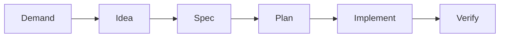
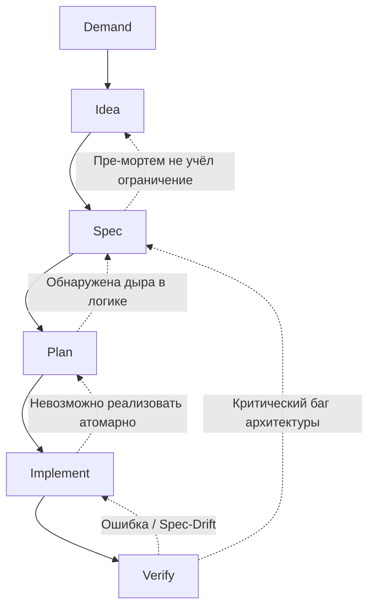

# DISPIV Engineering Pipeline

Данный документ описывает **DISPIV** — методологию Spec-Driven Development, основанную на широком взаимодействии человека с ИИ агентами. Процесс спроектирован так, чтобы максимизировать качество архитектуры и скорость внедрения изменений, при этом минимизируя расходы на ИИ.

> Если код не соответствует спецификации, то он должен быть к ней приведен

## Верхнеуровневый обзор пайплайна

Пайплайн состоит из 6 последовательных этапов, разделяющих зоны ответственности между Человеком, Сильным ИИ ($AI_{strong}$) и Слабым ИИ ($AI_{weak}$).



* **Demand (Человек):** Формулирование бизнес-проблемы или потребности.
* **Idea (Человек + $AI_{strong}$):** Генерация концепций решения, проведение пре-мортем анализа и выбор единого вектора.
* **Spec (Человек + $AI_{strong}$):** Пошаговая итеративная разработка строгой спецификации.
* **Plan (Человек + $AI_{strong}$):** Декомпозиция спецификации в гранулированный DAG-план по стратегии *Expand-Migrate-Contract*.
* **Implement ($AI_{weak}$ / Оркестратор):** Параллельное или последовательное выполнение атомарных задач непосредственно в кодовой базе.
* **Verify (Человек + Автоматика):** Финальная сборка, ручная проверка тестов и рантайм-валидация.

## Подробное описание этапов пайплайна

### Этап 1: Demand (Спрос / Потребность)

* **Ответственный:** Человек.
* **Суть:** Фиксация проблемы в "сыром" виде: боли пользователей, узкие места системы, бизнес-требования или новые фичи. Технические решения на этом этапе не предлагаются.
* **Артефакт:** Тикет с описанием проблемы.

### Этап 2: Idea (Концептуализация)

* **Ответственный:** Человек + $AI_{strong}$.
* **Суть:** Совместный штурм. $AI_{strong}$ предлагает альтернативные варианты решения. Проводится **Пре-мортем (Pre-mortem) анализ**: моделирование ситуаций, при которых решение может оказаться неэффективным. Выбирается одна оптимальная идея.
* **Артефакт:** Документ архитектурного решения (ADR), фиксирующий выбранную концепцию и результаты пре-мортема.

### Этап 3: Spec (Спецификация)

* **Ответственный:** Человек + $AI_{strong}$.
* **Суть:** Проектирование архитектуры и логики методом последовательного уточнения. ИИ подсвечивает пограничные случаи, предлагает варианты контрактов и структур данных; человек валидирует. Спецификация становится монолитным "источником истины" (Source of Truth).
* **Артефакт:** Файл с суффиксом `.spec.md` (например, `USER-REGISTRATION.spec.md`) — детальный технический документ с YAML-фронтматтером.

### Этап 4: Plan (Планирование)

* **Ответственный:** Человек + $AI_{strong}$.
* **Суть:** Трансляция спецификации в структурированный граф задач (DAG).
* **Стратегия Expand-Migrate-Contract:** Изменения разбиваются на безопасные фазы добавления, миграции и удаления, гарантируя отсутствие ломающих изменений (Compile-Safe Ordering).
* **Гранулярность:** Задачи декомпозируются до атомарного уровня, доступного для выполнения моделями без развитой логики (Chain of Thought).
* **Тестовые наброски (Test Sketches):** *До* финализации графа человек обязан написать наброски тестов на естественном языке или псевдокоде. Это принудительная мера, чтобы человек глубоко понял собственную спецификацию и не перекладывал ответственность за edge-cases на ИИ. $AI_{strong}$ учитывает эти наброски при генерации узлов графа.
* **Артефакт:** `manifest.md` (содержит инструментально-агностичный DAG в YAML-шапке и AI-промпты для задач в теле документа).

### Этап 5: Implement (Реализация)

* **Ответственный:** $AI_{weak}$ / Автономный оркестратор агентов.
* **Суть:** Атомарные задачи из DAG поступают на исполнение агентам. Выполнение может быть последовательным или параллельным (с распределением независимых ветвей графа между изолированными средами). Агенты получают в контекст только текущую задачу и актуальную спецификацию, без исторического мусора.
* **Артефакт:** Pull Request (PR) или измененный рабочий каталог.

### Этап 6: Verify (Верификация)

* **Ответственный:** Автоматика (CI/CD) + Человек.
* **Суть:** Финальный барьер качества:
1. Устранение ошибок компиляции.
1. Ручная проверка тестов, созданных на этапе Implement.
1. Проверка работоспособности всей системы.
* **Артефакт:** Заархивированная документация и влитый в основную ветку код.

**Spec-Drift анализ в CI:** $AI_{weak}$ в GitHub Action сравнивает `diff` кода со спецификацией. Он не просто блокирует PR, но и генерирует Markdown-отчет (Spec-Compliance Matrix) прямо в комментарии, чтобы мейнтейнер сразу видел статус соответствия.

## Механизм обработки блокеров (Feedback Loops)

Пайплайн предусматривает явные маршруты отката при возникновении проблем. ИИ агенты должны быть способны обнаружить блокер и при необходимости откатиться назад.



* **Из Verify в Implement:** Падение тестов, runtime-баги или срабатывание Spec-Drift детектора. Задача возвращается агенту с логом.
* **Из Verify в Spec:** Обнаружение принципиальных архитектурных ошибок. Код замораживается, спецификация перевыпускается.
* **Из Implement в Plan:** Невозможность выполнения задачи (слишком крупная или циклическая зависимость) — вызов $AI_{strong}$ для репланинга графа.
* **Из Plan в Spec:** Выявление логического тупика при декомпозиции или написании тестовых набросков.

## Контекстно-изолированная архитектура документации

*Здесь представлен пример организации документации в одном Git репозитории вместе с проектом. DISPIV в будущем может быть расширен для поддержки внешних хранилищ или сервисов документирования.*

Вся документация хранится в репозитории с жестким разделением форматов для экономии токенов и контроля фокуса у ИИ. Git является единственной системой версионирования — отдельные архивные папки не используются.

Примеры документов расположены в [/docs](/docs).

### Specs
* `/docs/specs/` (Markdown + YAML): Монолитные спецификации текущего состояния с кросс-ссылками. Это единственный Source of Truth для кодовой базы. Используются как эталон для планирования (Plan), внедрения (Implement) и проверки (Verify).

**Версионирование через Git:**
- Активная спека имеет имя `{MODULE}.spec.md` (без версии в названии)
- При мажорном изменении создается Git tag: `v1.0`, `v2.0` и т.д.
- Предыдущие версии доступны через `git show v1.0:docs/specs/MODULE.spec.md`
- В YAML Frontmatter фиксируется текущая версия (SemVer)

Структура директорий:
```
/docs/specs/
  ├── index.md                          # Реестр всех активных спек (таблица: имя, версия, статус, краткое описание, owner)
  ├── USER-REGISTRATION.spec.md           # Текущая активная спека (версия в YAML: v1.0)
  ├── NOTIFICATION.spec.md              # Текущая активная спека (версия в YAML: v2.1)
  └── CATALOG.spec.md                   # Текущая активная спека (версия в YAML: v1.3)
```

Каждый Spec-файл содержит:
- **YAML Frontmatter:** версия (SemVer), статус (Draft/Active/Deprecated), зависимости от других спек (`dependencies: [USER-MANAGEMENT.spec.md]`), ссылка на Idea-документ (`idea_ref: /docs/adrs/005-caching-strategy-v2.md`), история изменений (changelog таблицей).
- **Scope / Out of Scope:** Явные границы модуля.
- **Data Models / Contracts:** Строгие типы (Java classes, interfaces, DTOs), входящие/исходящие контракты API.
- **State Machines / Sequence Diagrams:** Mermaid-диаграммы поведения.
- **Business Rules:** Инварианты и правила, которые нельзя нарушать.
- **Test Scenarios:** Сценарии, написанные в свободной форме, которые формализуются на этапе Plan и превратятся в тесты на этапе Implement.

### Plans
* `/docs/plans/` (Markdown + YAML): Инструкции для оркестратора (DAG-граф в шапке) и промпты для агентов.

**Жизненный цикл плана:**
1. План создается в `/docs/plans/{PLAN-ID}/`
1. Выполняется на этапе Implement
1. После успешного Verify **вся директория плана удаляется** из рабочей ветки
1. История сохраняется в Git (можно восстановить через `git log --all -- docs/plans/{PLAN-ID}/`)

Структура директорий:
```
/docs/plans/DISPIV-USERREG-005/
  ├── manifest.md  # Главный файл (DAG-граф в YAML Frontmatter)
  ├── task-1.md    # Инструкция для агента 1 
  ├── task-2.md    # Инструкция для агента 2
  └── task-3.md    # Инструкция для агента 3
```

Альтернатива (если нужно сохранять выполненные планы для аудита):
- Добавить в `.gitignore` строку: `docs/plans/*/completed.flag`
- При успешном Verify создавать файл `completed.flag` в директории плана
- Настроить CI/CD на архивацию директорий с `completed.flag` во внешнюю систему (S3, артефакты Jenkins и т.д.)
- После архивации удалять директорию из Git

### Изоляция доступа (по этапам)
Изоляция доступа к документам дает для ИИ увеличение скорости и качества работы.

**Важно:** ИИ-модели получают явную инструкцию в системном промпте:
> "Читай только файлы, указанные в контексте этапа. Никогда не читай файлы с суффиксом `.deprecated.` или `.backup.`. Игнорируй файлы, не упомянутые в явном списке."

* **Demand:** ИИ не задействован. Локальный контекст человека (тикеты, аналитика, пользовательский фидбек).
* **Idea:** `demand.md` + `/docs/specs/index.md` (реестр для понимания текущих модулей) + `/docs/adrs/index.md` (реестр для учета прошлого опыта) + точечно конкретные ADR и Specs по запросу ИИ.
* **Spec:** `idea.md` (выбранный вектор) + `/docs/specs/` (текущие контракты затронутых модулей). Исходный код изолирован.
* **Plan:** Все измененные целевые `.spec.md` + декларации/интерфейсы затронутых файлов кода (извлекаются скриптом).
* **Implement:** Один конкретный файл задачи `task-X.md` (из общего плана) + исходный код файлов, подлежащих изменению.
* **Verify:** Все затронутые актуальные `.spec.md` + `git diff` (весь пул-реквест) + написанные на этапе Implement тесты.

### ADRs
* `/docs/adrs/` (Markdown): Исторический контекст и причины архитектурных решений. Фиксируют *почему* было принято то или иное решение, какие альтернативы рассматривались и почему они были отвергнуты. Читаются человеком и сильным ИИ на этапе Idea для избежания повторения прошлых ошибок.

Структура директорий:
```
/docs/adrs/
  ├── index.md                          # Реестр всех ADR (таблица: номер, статус, дата, краткое описание)
  ├── 001-event-driven-architecture.md  # Статус: Accepted. Почему выбрали event-driven подход.
  ├── 002-caching-strategy.md           # Статус: Superseded by 005. Первоначальная стратегия кэширования.
  ├── 005-caching-strategy-v2.md        # Статус: Accepted. Замена ADR-002.
  └── 007-abandoned-microservices.md    # Статус: Rejected. Почему отказались от микросервисов.
```

**Работа с устаревшими ADR:**
- ADR со статусом `Superseded` или `Rejected` **остаются в папке** `/docs/adrs/` (не удаляются)
- В `index.md` они помечаются соответствующим статусом
- Git история сохраняет все изменения
- ИИ-модели читают `index.md` и видят статус, поэтому не опираются на устаревшие решения

Каждый ADR-файл содержит:
- **YAML Frontmatter:** статус (Accepted/Rejected/Superseded/Deprecated), дата, связанные спеки (`related_specs`), связанные идеи (`related_ideas`).
- **Context:** Описание проблемы и ограничений на момент принятия решения.
- **Decisions:** Принятое решение и отвергнутые альтернативы (с обоснованием).
- **Consequences:** Ожидаемые положительные и отрицательные последствия.

---

### Список оставшихся вопросов (Открытые архитектурные решения)

1. **Оркестрация этапа Implement:** Требуется ли написание кастомного легковесного оркестратора для парсинга YAML-графов и запуска агентов, или можно адаптировать существующие open-source решения (например, LangGraph, автономные скрипты)?
1. **Brownfield-проекты (Интеграция в унаследованный код):** Как наиболее эффективно (с точки зрения потребления токенов) применять пайплайн к большим существующим кодовым базам без спецификаций? С чего начинать — с полного реверс-инжиниринга или точечного покрытия модулей?
1. **Пробелы в вопросе изоляции контекста** Непонятно, необходимо ли передавать ИИ агентам на этапе Implement соответствующие задаче `.spec.md`, или всю необходимую информацию описать в `task-X.md`.
1. **Доработка формата Spec:**
    1. Интеграция с внешними API (Outbound): Как мы описываем вызовы внешних систем (например, EmailGateway или платежные шлюзы)? Нужна ли нам секция Client Contracts (что мы шлем, что ожидаем, таймауты, retry-политики)?
    1. Конфигурация и Feature Flags: Должны ли мы описывать в спеке переменные окружения (например, REGISTRATION_MAX_ATTEMPTS, REDIS_TTL_HOURS) или это слишком низкоуровнево для этапа Spec и должно остаться на этапе Plan/Implement?
    1. Обработка ошибок (Error Handling Strategy): Стоит ли добавить глобальную секцию о том, как сервис мапит внутренние исключения в HTTP-статусы (или gRPC коды) для внешнего мира?
1. Как Weak AI на этапе Implement узнает про "Скрытые зависимости"?
В `task-3.md` мы пишем: *"Метод помечен `@Transactional`"*. Но что если в проекте используется кастомная аннотация `@AppTransactional` или специфичный конфигурационный класс для транзакций? 
    * **Проблема:** Weak AI, видя только `task-3.md` и `UserRegistrationService.java`, может добавить стандартный Spring `@Transactional`, который не подхватится кастомным сканером проекта.
    * **Предложение:** Ввести в `manifest.md` или в глобальный конфиг репозитория файл `.dispiv/context.md` (или `shared-utils.manifest.yaml`), который автоматически инжектится в промпт Weak AI. Там будут указаны глобальные правила: *"Всегда используй `@AppTransactional` вместо `@Transactional`"*, *"Все Entity должны наследоваться от `BaseEntity`"*.

1. Жизненный цикл Plan-директорий и Git-теги
В Pipeline сказано: *"После успешного Verify вся директория плана удаляется из рабочей ветки"*. 
    * **Проблема:** Если план удален, то при анализе инцидента (Post-Mortem) через полгода мы не поймем, *почему* Weak AI сгенерировал именно такой код. Мы увидим только коммиты.
    * **Предложение:** Вместо физического удаления, использовать **Git-теги для планов**. Когда Verify успешен, CI ставит тег `plan-completed/DISPIV-USERREG-005`, а затем скрипт удаляет папку. Это сохраняет снапшот плана в истории Git, но не засоряет рабочую ветку. Нужно ли это описать в Pipeline?

1. Обработка "Разорванных" спецификаций (Cross-Repo)
ADR-005 описывает микросервис `NotificationWorker`. В реальном мире он часто живет в **отдельном Git-репозитории**. 
    * **Проблема:** Как DISPIV работает, если `USER-REGISTRATION` в репозитории А, а `NOTIFICATION-WORKER` в репозитории Б? Spec-Drift анализ в CI репозитория А не сможет проверить код репозитория Б.
    * **Предложение:** Добавить в методологию концепцию **"Shared Contracts Repo"** (или Git Submodules), где хранятся *только* `.spec.md` и Protobuf/OpenAPI файлы, на которые ссылаются оба репозитория. Стоит ли добавлять это в раздел "Контекстно-изолированная архитектура"?

1. Формализация "Открытых вопросов" в Spece
В самом первом примере (Narrator API) был раздел "Открытые вопросы". Мы его убрали, решив, что Active спека не может иметь открытых вопросов. 
    * **Проблема:** Что делать, если на этапе Implement Weak AI находит неочевидный edge-case, который не покрыт в Test Scenarios? 
    * **Предложение:** Weak AI не должен сам решать. Он должен прервать задачу и сгенерировать артефакт `blocker.md` (или перевести статус задачи в `Blocked`), который триггерит возврат на этап **Spec** для человека и Strong AI. Нужно ли явно описать формат `blocker.md`?

### Список актуальных проблем методологии

1. **Проблема слепоты слабого ИИ (Utility Blindness):** Жесткая изоляция контекста на этапе Implement может приводить к дублированию утилитарного кода. Агент не знает о существовании глобальных хелперов в проекте, если они не описаны прямо в спеке. *(Потенциальное решение: вести `shared-utils.manifest.yaml`, который автоматически инжектится в контекст агента).*
1. **Деградация качества Plan-графа:** Современные LLM иногда ошибаются в топологической сортировке и выстраивании DAG, допуская скрытые циклические зависимости или нарушая последовательность безопасной компиляции.
1. **Когнитивная нагрузка ревьюера:** На этапе Verify человеку всё равно требуется глубоко понимать сгенерированный агентами код. Если тесты прошли, реализация всё еще может быть неоптимальной с точки зрения потребления памяти или перформанса.
1. **Риск рассинхронизации (Human factor):** При экстренных "хотфиксах" разработчики склонны вносить изменения напрямую в код (минуя этапы Demand-Spec). Это мгновенно делает спецификации невалидными и ломает весь пайплайн на этапе контроля Spec-Drift.
1. **Бесконечные циклы откатов (Infinite Rollback Loops):** При автоматизированной системе (когда CI возвращает ошибку компиляции обратно в Implement или Plan) есть риск зацикливания агентов. ИИ может бесконечно применять одни и те же ошибочные исправления. Требуется внедрение механизма "Circuit Breaker" (предохранителя), который после 3-й попытки эскалирует проблему на человека.
1. **Риск галлюцинаций деструктивных действий (Destructive Actions):** На этапе планирования или реализации ИИ может ошибочно принять решение "Contract" (удаление) для жизненно важных файлов, спутав их с легаси. Требуется песочница или строгий AST-контроль, запрещающий агентам удалять файлы за пределами явно указанного Target-scope.