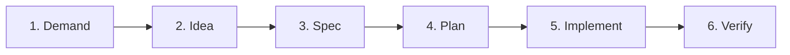
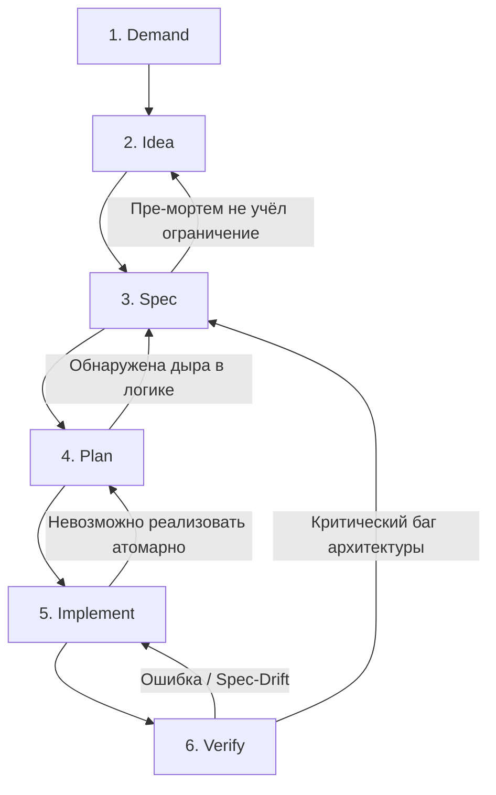

# DISPIV Engineering Pipeline

Данный документ описывает **DISPIV Engineering Pipeline** — системный подход к разработке программного обеспечения, построенный на синергии человека, сильных (глубоких) ИИ-моделей и слабых (быстрых/узкоспециализированных) ИИ-агентов. Процесс спроектирован так, чтобы максимизировать качество архитектуры, снизить когнитивную нагрузку на человека и обеспечить предсказуемую автоматическую реализацию задач через направленные ациклические графы (DAG).

## 1. Верхнеуровневый обзор пайплайна

Пайплайн состоит из 6 последовательных этапов, разделяющих зоны ответственности между Человеком ($H$), Сильным ИИ ($AI_{strong}$) и Слабым ИИ ($AI_{weak}$).

* **Demand (Человек):** Формулирование бизнес-проблемы или потребности.
* **Idea (Человек + $AI_{strong}$):** Генерация концепций решения, проведение пре-мортем анализа и выбор единого вектора.
* **Spec (Человек + $AI_{strong}$):** Пошаговая итеративная разработка строгой спецификации.
* **Plan (Человек + $AI_{strong}$):** Декомпозиция спецификации в гранулированный DAG-план по стратегии *Expand-Migrate-Contract*.
* **Implement ($AI_{weak}$ / Оркестратор):** Параллельное или последовательное выполнение атомарных задач непосредственно в кодовой базе.
* **Verify (Человек + Автоматика):** Финальная сборка, рантайм-валидация и контроль соответствия спецификации (Spec-Drift).

## 2. Подробное описание этапов пайплайна

### Этап 1: Demand (Спрос / Потребность)

* **Ответственный:** Человек.
* **Суть:** Фиксация проблемы в "сыром" виде: боли пользователей, узкие места системы, бизнес-требования или новые фичи. Технические решения на этом этапе не предлагаются.
* **Артефакт:** ADR-документ или тикет с описанием проблемы.

### Этап 2: Idea (Концептуализация)

* **Ответственный:** Человек + $AI_{strong}$.
* **Суть:** Совместный штурм. $AI_{strong}$ предлагает альтернативные варианты решения. Проводится **Пре-мортем (Pre-mortem) анализ**: моделирование ситуаций, при которых решение может оказаться неэффективным. Выбирается одна оптимальная идея.
* **Артефакт:** Документ архитектурного решения (ADR), фиксирующий выбранную концепцию и результаты пре-мортема.

### Этап 3: Spec (Спецификация)

* **Ответственный:** Человек + $AI_{strong}$.
* **Суть:** Проектирование архитектуры и логики методом последовательного уточнения. ИИ подсвечивает пограничные случаи, предлагает варианты контрактов и структур данных; человек валидирует. Спецификация становится монолитным "источником истины" (Source of Truth).
* **Артефакт:** `.spec.md` — детальный технический документ с YAML-фронтматтером.

### Этап 4: Plan (Планирование)

* **Ответственный:** $AI_{strong}$ + Человек.
* **Суть:** Трансляция спецификации в структурированный граф задач (DAG).
* **Стратегия Expand-Migrate-Contract:** Изменения разбиваются на безопасные фазы добавления, миграции и удаления, гарантируя отсутствие ломающих изменений.
* **Гранулярность:** Задачи декомпозируются до атомарного уровня, доступного для выполнения моделями без развитой логики (Chain of Thought).
* **Тестовое покрытие:** План включает написание тестов. Человек может дописать пограничные сценарии, что вызывает автоматическую переоценку плана ИИ.

* **Артефакт:** `plan.md` (содержит DAG в YAML-шапке и AI-промпты для задач в теле документа).

### Этап 5: Implement (Реализация)

* **Ответственный:** $AI_{weak}$ / Автономный оркестратор агентов.
* **Суть:** Атомарные задачи из DAG поступают на исполнение агентам. Выполнение может быть последовательным или параллельным (с распределением независимых ветвей графа между изолированными средами). Агенты получают в контекст только текущую задачу и актуальную спецификацию, без исторического мусора.
* **Артефакт:** Pull Request (PR) или измененный рабочий каталог.

### Этап 6: Verify (Верификация)

* **Ответственный:** Автоматика (CI/CD) + Человек.
* **Суть:** Финальный барьер качества:
1. **Spec-Drift анализ:** Легковесный ИИ в CI-пайплайне сравнивает `diff` кода со спецификацией. При выявлении расхождений PR блокируется.
2. Устранение ошибок компиляции и прогон тестов.
3. Человек проверяет работу системы в рантайме (UI/UX).

* **Артефакт:** Заархивированная документация и влитый в основную ветку код.

## 3. Механизм обработки блокеров (Feedback Loops)

Пайплайн предусматривает явные маршруты отката при возникновении проблем:

* **Из Verify в Implement:** Падение тестов, runtime-баги или срабатывание Spec-Drift детектора. Задача возвращается агенту с логом.
* **Из Verify в Spec:** Обнаружение принципиальных архитектурных ошибок. Код замораживается, спецификация перевыпускается.
* **Из Implement в Plan:** Невозможность выполнения задачи (слишком крупная или циклическая зависимость) — вызов $AI_{strong}$ для репланинга графа.
* **Из Plan в Spec:** Выявление логического тупика при декомпозиции или написании тестов.

## 4. Контекстно-изолированная архитектура документации

Вся документация хранится в репозитории с жестким разделением форматов для экономии токенов и фокуса ИИ:

* `/docs/adrs/` (Markdown): Исторический контекст и причины решений. Читается человеком и сильными ИИ (Idea).
* `/docs/specs/` (Markdown + YAML): Монолитные спецификации текущего состояния. Используются как эталон для кодирования (Implement) и проверки (Verify).
* `/docs/plans/` (Markdown + YAML): Инструкции для оркестратора (DAG-граф в шапке) и промпты для агентов.
* `/docs/archive/`: Устаревшие артефакты, изолированные от контекста ИИ.

---

### 1. Список оставшихся вопросов (Открытые архитектурные решения)

1. **Оркестрация этапа Implement:** Требуется ли написание кастомного легковесного оркестратора для парсинга YAML-графов и запуска агентов, или можно адаптировать существующие open-source решения (например, LangGraph, автономные скрипты)?
2. **Brownfield-проекты (Интеграция в унаследованный код):** Как наиболее эффективно (с точки зрения потребления токенов) применять пайплайн к большим существующим кодовым базам без спецификаций? С чего начинать — с полного реверс-инжиниринга или точечного покрытия модулей?
3. **Обработка "Spec-Drift" в CI:** Как настроить порог чувствительности Spec-Drift детектора, чтобы он не блокировал PR из-за незначительного рефакторинга (например, переименования внутренних переменных), не меняющего публичные контракты и бизнес-логику?
4. **Слияние параллельных веток (Implement):** Как гарантировать, что независимые ИИ-агенты, работающие над параллельными задачами в графе (DAG), не создадут конфликтов слияния (merge conflicts) при сложной модификации одного и того же файла?

### 2. Список актуальных проблем методологии

1. **Проблема слепоты слабого ИИ:** Жесткая изоляция контекста на этапе Implement (когда агент видит только спеку и пару файлов) может приводить к дублированию утилитарного кода. Агент не знает о существовании глобальных хелперов в проекте, если они не описаны прямо в спеке.
2. **Деградация качества Plan-графа:** Современные LLM иногда ошибаются в топологической сортировке и выстраивании DAG, допуская скрытые циклические зависимости или нарушая последовательность безопасной компиляции (Compile-Safe Ordering).
3. **Когнитивная нагрузка ревьюера:** На этапе Verify человеку всё равно требуется глубоко понимать сгенерированный агентами код. Если тесты прошли, реализация всё еще может быть неоптимальной с точки зрения потребления памяти или перформанса.
4. **Риск рассинхронизации (Human factor):** При экстренных "хотфиксах" разработчики склонны вносить изменения напрямую в код (минуя этапы Demand-Spec). Это мгновенно делает спецификации невалидными и ломает весь пайплайн на этапе контроля Spec-Drift.