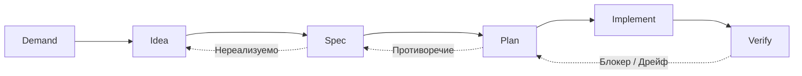
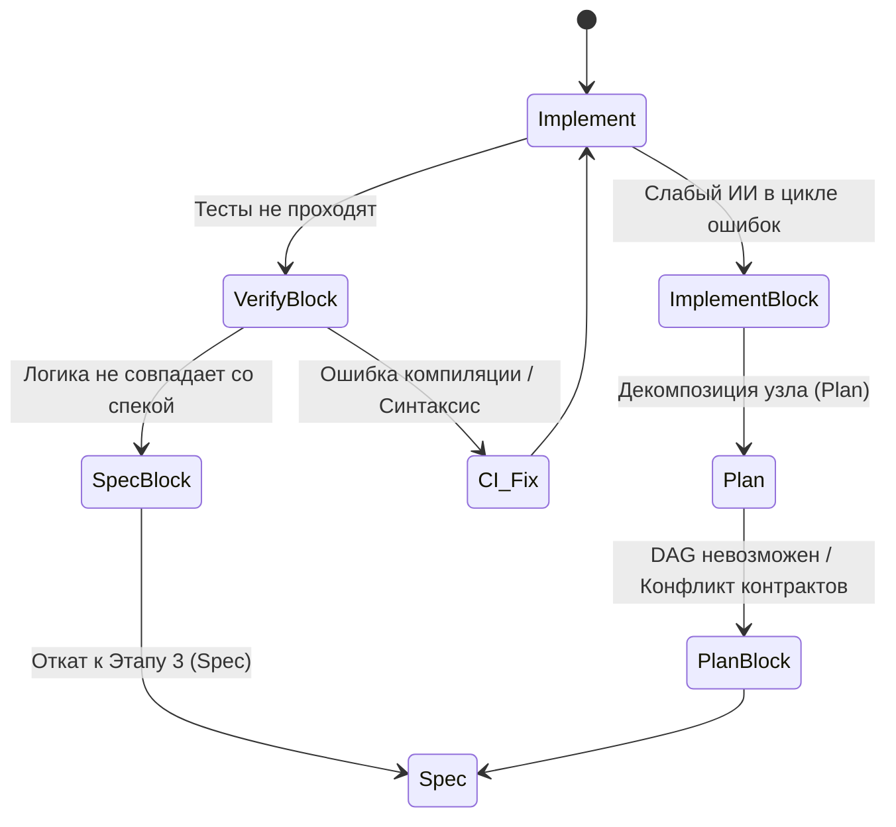

# DISPIV: Spec-Driven AI Engineering Pipeline

**Статус:** RFC v0.1 (Request for Comments)  
**Суть в одном предложении:** Превратить дорогое стратегическое мышление (сильный ИИ) в детерминированный артефакт (спецификация + DAG-план), который дешевый тактический исполнитель (слабый ИИ) реализует механически, а человек верифицирует через тесты и CI.

---

## Сравнение DISPIV и аналогов

| Критерий | DISPIV | OpenSpec |
|:---------|:------:|:--------:|
| Spec как единый связный документ | ✅ | ❌ (фрагменты-дельты) |
| Гранулярность плана под слабую LLM | ✅ (DAG + YAML) | ❌ (задания для архитектора) |
| Экономия токенов LLM | ✅ (Spec-First) | ⚠️ (нет ограничений на чтение) |
| Compile-safe Expand-Migrate-Contract | ✅ (инвариант) | ❌ (нарушает) |
| Человекочитаемость | ✅ | ⚠️ (только для LLM) |

---

## 0. Высокоуровневый обзор

DISPIV решает главную проблему современных AI-агентов: **потерю контекста и архитектурную деградацию** на длинных дистанциях. В этом пайплайне кодовая база никогда не является источником истины (Source of Truth). Source of Truth — это **Спецификации и Тесты**. Код существует только для того, чтобы им удовлетворять.

**Два незыблемых инварианта:**
1. **Source of Truth = Спецификация + Тесты.** Если код разошёлся со спекой — правим код (или обновляем спеку, если она устарела), но никогда не «договариваемся на словах».
2. **Граница мышления.** Дорогая модель производит *артефакт-инструкцию*, дешёвая — *исполняет* её. Чем качественнее артефакт, тем дешевле и надёжнее исполнение.

---

## 1. Этапы пайплайна

### Stage 0: Discovery (Опционально, для Brownfield)
* **Актор:** Сильный ИИ.
* **Суть:** Перед внедрением пайплайна в легаси-проект强кая модель один раз сканирует кодовую базу и генерирует "Baseline Specs" (спецификации "as-is"). 
* **Зачем:** Это разовая плата за вход. После этого кодовая база навсегда удаляется из контекста сильных моделей на этапах 2-4, чтобы избежать **Context Poisoning** (эпистемологического отравления, когда модель начинает опираться на легаси-костыли вместо проектирования чистых контрактов).

### Stage 1: Demand (Запрос)
* **Актор:** Человек.
* **Суть:** Формулировка бизнес- или технической проблемы без привязки к решению.
* **Анти-паттерн:** «Нужен WebSocket-эндпоинт» (это решение). Правильно: «Пользователь теряет прогресс при разрыве сети».

### Stage 2: Idea (Идея)
* **Акторы:** Человек + Сильный ИИ (Reasoning).
* **Суть:** Брейншторм 3-4 вариантов архитектуры. Обязательный **Pre-mortem**: ИИ и человек моделируют сценарий, где проект провалился через год, и выявляют причины.
* **Артефакт:** `idea-decision.md` (выбранная концепция, отвергнутые альтернативы, результаты pre-mortem).

### Stage 3: Spec (Спецификация)
* **Акторы:** Человек + Сильный AI (CoT).
* **Суть:** Итеративная разработка контрактов через диалог. Документ должен быть идеален для чтения человеком (Mermaid, таблицы, обоснования) и ИИ (строгие типы, явные границы Scope).
* **Экономия токенов (Spec-First Context):** Чтобы сильная модель не читала весь проект, используется **`index.md`** — легковесный скрипт собирает абстракты (заголовки и краткие описания) всех спек из `/docs/specs/`. ИИ читает только индекс и точечно запрашивает полные тексты нужных `.md` файлов.
* **Артефакт:** `*.spec.md` (например, `NARRATOR.spec.md`).

### Stage 4: Plan (Гранулированный DAG)
* **Актор:** Сильный/Средний ИИ (CoT и большой контекст).
* **Уточнение по архитектуре (Разрешение противоречия):** В исходных требованиях указано, что модель на этапе Plan должна быть «без Chain of Thought», но в описании эксперимента упоминается модель «с chain of thoughts». **Архитектурно верно следующее:** генерация Плана (Stage 4) **категорически требует** CoT/Reasoning для построения сложного графа зависимостей. А вот исполнение (Stage 5) строго **без CoT**.
* **Суть:** Трансляция спеки в направленный ациклический граф (DAG) по стратегии **Expand-Migrate-Contract**.
* **Формат вывода:** План должен быть разделен. Человеку — краткое Markdown-описание. Оркестратору и слабому ИИ — **машиночитаемый YAML/JSON DAG** с точными путями, сигнатурами и флагами `Action`.
* **TDD-инвариант:** Граф обязан содержать узлы генерации тестов **строго до** узлов реализации. ИИ пишет скелеты тестов на основе `Scenario` из спеки, человек ревьюит их на этом этапе.

### Stage 5: Implement (Сборка)
* **Актор:** Слабый ИИ / Оркестратор.
* **Суть:** Механическое выполнение узлов DAG. Слабый ИИ не принимает решений, он транслирует YAML-план в код. Независимые ветки (Expand) выполняются параллельно субагентами.
* **Безопасность и Сэндбоксинг:** Слабые модели склонны к галлюцинациям. Оркестратор обязан использовать **AST-валидацию и строгий file-system sandboxing**, чтобы слабый ИИ физически не мог модифицировать файлы вне скоупа текущей задачи или выполнить деструктивные команды. Синхронизация состояния между параллельными агентами лежит на оркестраторе.

### Stage 6: Verify (Верификация)
* **Актор:** CI/CD Gate + Человек.
* **Суть:** 
  1. **Автоматический CI-Gate:** Компиляция и прогон тестов. Человек не должен править ошибки импортов вручную — это задача оркестратора и слабого ИИ (возврат на Implement).
  2. **Ручная проверка:** Человек проверяет рантайм и соответствие тестов спеке.
  3. **Эпистемологическая петля (Риск):** Если ИИ неправильно понял спеку на этапе Plan, он напишет тесты, которые проверяют неверное поведение. Возникнет "замкнутый круг ложной уверенности". *Митигация:* Человек на этапе Verify проверяет не только факт прохождения теста, но и то, *что именно* тест проверяет (человек ревьюит сценарии тестов, а не только ассерты).
  4. **Архивация:** Артефакты коммитятся в `/docs`.

---

## 2. Ключевые механики

### Механика откатов (Escape Hatches)
Процесс не линеен. При возникновении тупиков срабатывает протокол отката. Откат без записи причины (ADR) запрещён.

### Версионирование и Документация
Отказываемся от фрагментированных дельт в пользу **Git + SemVer + ADR**:
1. **Spec:** Единый `.md` файл. Мажорные/минорные изменения обновляют SemVer в шапке и добавляют строку во внутреннюю History-таблицу.
2. **Plan:** Машиночитаемый `.yaml`/`.json`, жестко привязанный к версии спеки (через YAML Frontmatter).
3. **Связи:** Frontmatter в спеке содержит кросс-ссылки на `ideas/`, `plans/` и `adr/` (Architecture Decision Records — почему было принято то или иное решение).

### Контроль дрейфа (Spec-Drift Detector)
Между релизами код может разойтись со спекой из-за ручных хотфиксов. Раз в спринт запускается **Spec-Drift Detector**: сильная модель анализирует только `git diff` за период и сверяет изменения с актуальными спеками. Если код ушел в сторону — генерируется блок-тикет на обновление спеки или откат кода.

---

## 3. Критический анализ и Вердикт по OpenSpec

### Почему OpenSpec выдал плохой результат?
Ваша интуиция абсолютно верна: результат OpenSpec не соответствует требованиям пайплайна. Но причина не в том, что вы «неправильно с ним работали». Это **фундаментальный mismatch инструмента и задачи**, усиленный механическими ошибками фреймворка.

1. **Инструментально-задачный конфликт (Tool-Task Mismatch):** 
   OpenSpec спроектирован для управления жизненным циклом спеки (предложить дельту, провести ревью) и работы с сильными агентами-архитекторами. Он генерирует `tasks.md` в формате высокоуровневых указаний (например, `1.1 Rewrite WebSocketContracts.kt...`). Это отличная задача для сильного ИИ, но **катастрофа для слабого ИИ без CoT на этапе Implement**. Слабой модели нужен атомарный YAML с точными сигнатурами и флагом `Do NOT modify X`, а не абстрактные призывы к рефакторингу.
2. **Грубейшее нарушение Expand-Migrate-Contract:** 
   В сгенерированном плане OpenSpec предложил `Task 4: Replace Shared Contract Models (BREAKING)`, который намеренно ломает компиляцию всего сервера, с пометкой «починим в Tasks 5-7». Это **полное непонимание паттерна**. Суть Expand-Migrate-Contract в том, чтобы проект компилировался и работал на *каждом* промежуточном шаге (сначала добавляем новое рядом, потом переводим клиентов, потом удаляем старое). Compile-safe ordering был проигнорирован.
3. **Подмена этапов (Написание кода вместо планирования):** 
   План от OpenSpec содержит сотни строк готового Kotlin-кода. На этапе Plan это трата дорогих токенов. План должен описывать *структуру и зависимости*, а сам код должен писать слабый ИИ на этапе Implement.
4. **Отсутствие TDD-узлов:** 
   В графе OpenSpec нет явных атомарных задач на написание тестов, покрывающих спеку. Тесты не материализованы как Source of Truth.
5. **Фрагментация контекста:** 
   OpenSpec плодит `gap-analysis`, `proposal`, `design`, `tasks`. Для пайплайна, борющегося за экономию токенов, это избыточный шум.

### Вердикт: Что делать с OpenSpec?
**Не пытайтесь «допилить» промпты OpenSpec под ваш пайплайн.** 
* **Откажитесь** от использования OpenSpec для генерации Планов (DAG) и Спецификаций. Ваш собственный формат `NARRATOR.spec.md` (с Mermaid, обоснованиями и семантической связностью) объективно лучше для роли Source of Truth.
* **Заимствуйте** у OpenSpec только идею фиксации архитектурных решений (Decisions/Risks) и перенесите её в формат ADR (Architecture Decision Records) в папку `/docs/adr/`.
* **Пишите свой промпт/скрипт** для этапа Plan, который заставляет сильную модель выдавать строгий JSON/YAML граф задач без генерации имплементации.

---

## 4. Открытые вопросы для следующей итерации (Q&A)

Для перехода к версии v1.1 и написания конкретных промпт-шаблонов, ответьте на следующие вопросы:

1. **Оркестрация Implement-этапа:** Какую инфраструктуру вы используете для слабых моделей? Это IDE-агенты (Cursor/Cline), CLI (Aider) или кастомный Python/LangGraph оркестратор? От этого зависит схема AST-валидации и формат YAML-плана.
2. **Spec-Drift Detector:** Как часто вы планируете запускать проверку дрейфа и какой объем `git diff` считается допустимым для одного прогона без перегрузки контекстного окна?
3. **Генерация тестов:** На этапе Plan, когда ИИ генерирует TDD-узлы, вы хотите, чтобы он писал полноценные моки и ассерты, или только скелеты (`// TODO: assert state`), которые человек заполнит перед коммитом плана?

*Документ открыт к критике. Версионируется вместе с пайплайном.*