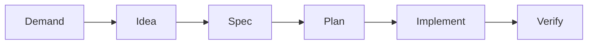
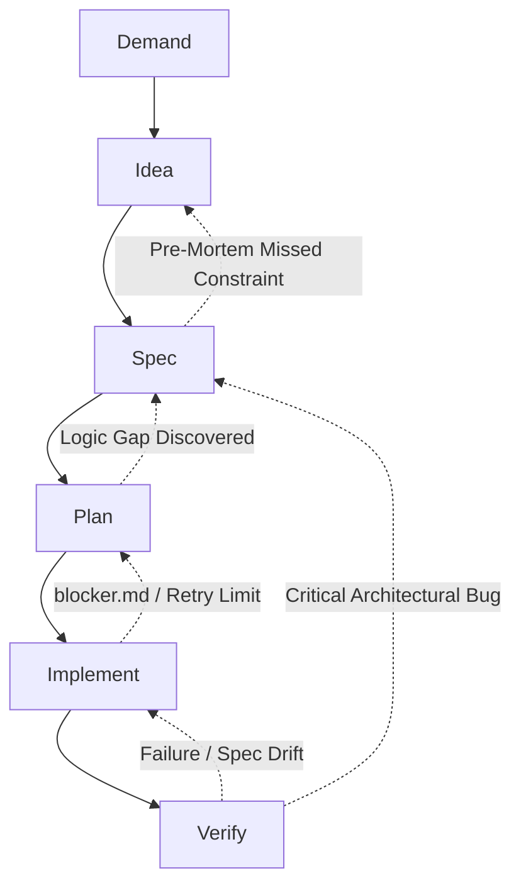

  <a href="./README.md">Русский</a> |
  English

# DISPIV Engineering Pipeline

This document describes **DISPIV** — a Spec-Driven Development methodology built around extensive collaboration between humans and AI agents. The process is designed to maximize architectural quality and implementation speed while minimizing AI-related costs.

The methodology is based on strict phase separation, rigorous context isolation to reduce AI cognitive load, and a Markdown-based "Single Source of Truth" documentation system.

## High-Level Pipeline Overview

The pipeline consists of six sequential phases that clearly separate responsibilities between the Human, Strong AI ($AI_{strong}$), and Weak AI ($AI_{weak}$).

* **Demand (Human):** Definition of a business problem or need.
* **Idea (Human + $AI_{strong}$):** Generation of solution concepts, pre-mortem analysis, and selection of a single direction.
* **Spec (Human + $AI_{strong}$):** Iterative development of a formal specification. Creation of test sketches.
* **Plan ($AI_{strong}$):** Decomposition of the specification into a granular DAG plan using the Expand-Migrate-Contract strategy.
* **Implement ($AI_{weak}$ / Orchestrator):** Parallel or sequential execution of atomic tasks directly within the codebase.
* **Verify (Human + Automation):** Final assembly, manual test verification, and runtime validation.

---

<b>Detailed Pipeline Description</b>

### Phase 1: Demand

* **Owner:** Human.
* **Purpose:** Capture the problem in its raw form. No technical solutions are proposed at this stage.
* **Artifact:** Problem ticket.

### Phase 2: Idea

* **Owner:** Human + $AI_{strong}$.
* **Purpose:** Brainstorming and solution exploration. Pre-mortem analysis and similar techniques are applied. A single optimal solution is selected.
* **Artifact:** Architecture Decision Record (`.adr.md`).

### Phase 3: Spec

* **Owner:** Human + $AI_{strong}$.

* **Purpose:** Architecture and logic design through progressive refinement. The specification becomes the authoritative source of truth.

* **Test Sketches:** The human author must write natural-language test sketches. These are required for downstream phases and help ensure understanding of the specification while covering the most critical scenarios before implementation begins.

* **Brownfield Development:** Work starts with the affected module rather than reverse-engineering the entire codebase. Specifications are written only for components impacted by the initiative.

* **Scaling and Decomposition (Split Limits):** If the initiative requires large-scale changes, the specification must be decomposed into multiple files to prevent LLM context degradation (Attention Drop). Splitting is recommended when at least one of the following heuristics applies:

  1. **Domain Boundaries:** The feature affects multiple layers with different technology stacks.
  2. **Specification Size:** A `*.spec.md` exceeds approximately $S \ge 500$ lines.
  3. **Pipeline Depth:** The expected implementation requires $N_{tasks} \ge 10$ atomic tasks.

* **Artifact:** `*.spec.md` files.

### Phase 4: Plan

* **Owner:** $AI_{strong}$.

* **Purpose:** Translate a specification into a structured DAG of tasks.

* **Expand-Migrate-Contract (EMC):** Changes are divided into safe expansion, migration, and contraction phases, guaranteeing Compile-Safe Ordering.

* **Artifact:** `manifest.plan.md` and a set of atomic task instructions (`task-X.md`).

### Phase 5: Implement

* **Owner:** $AI_{weak}$ / Autonomous Agent Orchestrator.

* **Purpose:** Atomic DAG tasks are executed by agents. Significant token savings are achieved through clean context windows and strict isolation of accessible files.

  The orchestrator may be implemented using standard CI/CD systems (e.g., GitHub Actions Matrix, GitLab CI DAGs) or LangGraph. A custom execution engine is not required.

* **Exception Handling:** If $AI_{weak}$ encounters a non-trivial edge case, it must stop execution and generate a `blocker.md` artifact for escalation.

* **Artifact:** Modified working directory or Pull Request.

### Phase 6: Verify

* **Owner:** Automation (CI/CD) + Human.

* **Purpose:** Final quality gate, including Spec-Drift analysis and Markdown report generation in CI.

* **Artifact:** Accepted Pull Request.

---

<b>Blocker Handling and Feedback Loops</b>

The pipeline explicitly supports rollback and escalation paths. AI agents must be capable of identifying blockers and returning to earlier stages when necessary.

A built-in **Circuit Breaker** mechanism is used: if the number of automated recovery attempts reaches $N \ge 3$, the task is forcefully blocked and escalated to the Human and $AI_{strong}$.

* **Verify → Implement:** Failed tests or detected Spec Drift.
* **Verify → Spec:** Fundamental architectural issues discovered.
* **Implement → Plan:** `blocker.md` generated or Circuit Breaker activated.
* **Plan → Spec:** Logical dead-end detected during planning.
* **Spec → Idea:** Previously unknown constraints invalidate assumptions.

---

<b>Context-Isolated Documentation Architecture</b>

All documentation is stored in the repository with strict format separation to reduce token consumption and improve versioning efficiency.

**Cross-repository specifications** (for microservices residing in separate repositories) should be extracted into a dedicated Shared Contracts Repository or Git Submodule containing only `.spec.md` files and Protobuf/OpenAPI contracts.

Documentation is separated into two layers:

* **Business & Architecture** (`/docs/`)
* **Tooling & Agent Configuration** (`.dispiv/`)

This separation prevents unnecessary context pollution for AI agents.

### A. Product and Architecture Layer (`/docs/`)

#### 1. Specs (`/docs/specs/`)

The sole Source of Truth for the codebase.

Each specification includes:

* YAML Frontmatter (status, dependencies, `related_specs`)
* Scope / Out of Scope boundaries
* Data Models & Inter-Service Contracts (including outbound integrations, retry policies, and timeouts)
* State Machines / Sequence Diagrams
* Configuration & Feature Flags
* Global Error Handling mappings
* Test Scenarios / Invariants

#### 2. Plans (`/docs/plans/`)

Instructions for orchestrators (`manifest.plan.md`) and atomic prompts for $AI_{weak}$ (`task-X.md`).

**Plan Lifecycle with Git Tagging**

1. The plan is created and executed.

2. After successful verification, CI creates a Git tag:

   `plan-completed/{PLAN-ID}`

3. The plan directory is physically removed from the repository.

This keeps branches clean while preserving recoverability through Git history for post-mortem analysis.

#### 3. ADRs (`/docs/adrs/`)

Historical context and rationale behind architectural decisions, including pre-mortem reports.

---

### B. Agent Configuration Layer (`.dispiv/`)

#### Global Project Context (`.dispiv/styleguide.md`)

To address utility blindness and hidden dependencies, a centralized `styleguide.md` (or `context.md`) file is maintained at the repository root.

This file is automatically injected into every $AI_{weak}$ prompt and contains framework-wide conventions such as:

* Always use `@AppTransactional`
* Log through `Logbook`
* Approved and prohibited libraries
* Shared coding standards

---

<b>Access Isolation by Phase</b>

Document isolation improves execution speed and reduces AI costs.

> System Prompt: "Read only files explicitly provided in the context. Ignore backups and files outside the current phase responsibility."

* **Demand:** No AI involvement.
* **Idea:** `*.demand.md` + `/docs/specs/index.md` + `/docs/adrs/index.md` + relevant specs.
* **Spec:** `*.adr.md` + `/docs/specs/`. Source code remains isolated.
* **Plan:** Modified `*.spec.md` files + abstract interfaces + implementations.
* **Implement:** `task-X.md` + `.dispiv/styleguide.md` + specification invariants + target source files.
* **Verify:** All affected specifications + full Pull Request diff.

---

<b>Known Methodology Limitations</b>

### 1. Plan Graph Quality Degradation

Modern LLMs may incorrectly perform topological sorting or DAG construction, creating hidden cycles or violating compile-safe ordering.

**Recommended Solution:** Deterministic graph validation.

Require the planning phase to output strict JSON/YAML manifests containing task identifiers and dependencies. Before implementation, a validation script performs topological sorting and cycle detection. Any issue immediately blocks execution and reports the problematic node.

### 2. Reviewer Cognitive Load During Verification

Humans must still understand generated code. Passing tests does not guarantee acceptable memory consumption, scalability, or algorithmic complexity.

**Recommended Solution:** Integrate CodeQL, Semgrep, SonarQube, and similar static analysis tools into CI.

### 3. Human-Induced Specification Drift

Emergency hotfixes often bypass specifications and directly modify code, invalidating the Source of Truth.

**Recommended Solution:** Reverse-Spec Emergency Lane.

Hotfix branches bypass standard specification-first flow. CI detects the `hotfix/` prefix and launches a reverse-engineering agent that analyzes the diff and automatically generates specification updates through a follow-up Pull Request.

### 4. Hallucinated Destructive Actions

During implementation, AI may incorrectly delete critical files while performing contract-phase cleanup.

**Recommended Solution:** Cerberus Orchestrator.

Require the planning phase to generate a FileSystem Allowlist for every task. Any attempt to modify or delete files outside the approved scope is immediately blocked and escalated.

### 5. Specification Isolation Risks

Complete source code isolation during the Spec phase assumes specifications are self-sufficient. AI-generated specifications may conflict with existing interfaces.

**Recommended Solution:** Code Skeleton Generation.

Automatically generate lightweight project skeletons (e.g., using Tree-sitter, ctags, or TypeScript declarations) and provide public API signatures without implementation details during specification design.

### 6. Plan-Phase Discovery Problem

Who determines impacted files before planning begins?

**Recommended Solution:** Discovery Agent.

Introduce a lightweight discovery phase between Spec and Plan. A read-only search agent analyzes the specification and produces a validated list of files likely to be affected. This list is reviewed by a human or passed directly into planning.

