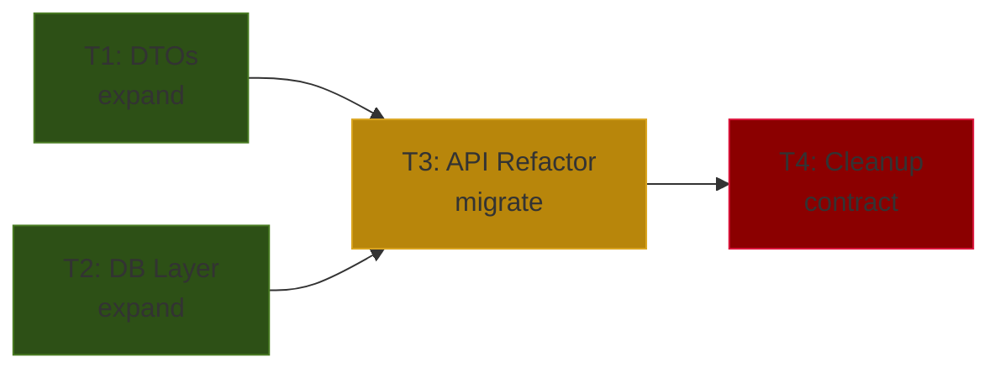

# Cart API v3.0 — Implementation Plan

## Gap Analysis Summary

| Area | Spec v3.0 | Current Implementation | Delta | EMC Phase |
|:---|:---|:---|:---|:---|
| **REST API** | `POST /api/v3/cart/items` | `POST /api/v1/cart/add` | Rename + new payload | Migrate |
| **State** | `CartState` (ACTIVE, PAID) | Boolean `isPaid` | Replace + enforce | Expand → Contract |
| **Storage** | Database Table `cart_items` | In-memory `ConcurrentHashMap` | Migrate to PostgreSQL | Expand → Migrate |
| **DTO** | `CartItemRequest` | `AddToCartForm` | New class, deprecate old | Expand |

## Execution Graph

## Compile-Safe Ordering & Execution Strategy

| Step | Task | EMC Phase | Breaks? | Parallel Group | Rollback |
|:---|:---|:---|:---|:---|:---|
| 1 | T1: DTOs | Expand | No | A | Delete new files |
| 1 | T2: DB Layer | Expand | No | A | Delete new files |
| 2 | T3: API Refactor | Migrate | **Yes** | B | Revert T3, restore old API |
| 3 | T4: Cleanup | Contract | No | C | N/A (irreversible) |

> **⚠️ Group B Warning:** После T3 проект не компилируется до завершения T3. 
> Оркестратор должен выполнить T3 атомарно. При провале — откат к состоянию после Group A.