# User Registration Outbox Migration — Implementation Plan

## Gap Analysis Summary

| Area | Spec v1.1.0 (Target) | Current Implementation (v1.0.0) | Delta | EMC Phase |
|:---|:---|:---|:---|:---|
| **DB Schema** | Add `outbox_events` table | Only `users` table | Add new table + JPA Entity | Expand |
| **Contracts** | `UserRegisteredEvent` DTO | None | Add Kafka record DTO | Expand |
| **Integration** | `OutboxEventPublisher` | None | Add publisher bridging DB & DTO | Expand |
| **Business Logic** | Async via Outbox | Sync via `EmailGateway` | Replace sync call with DB insert | Migrate |
| **Dependencies** | Remove direct email dep | `Spring Web`, `EmailGateway` | Cleanup unused beans | Contract |

## Execution Graph (Parallelized)

```mermaid
flowchart LR
    subgraph Group A [Group A: Parallel Expand]
        direction LR
        T1[T1: DB Schema<br/>PostgreSQL] 
        T2[T2: Kafka DTOs<br/>Java Records]
    end
    
    T1 --> T3
    T2 --> T3
    
    T3[T3: Outbox Publisher<br/>Integration] --> T4[T4: Service Refactor<br/>Migrate ⚠️]
    T4 --> T5[T5: Cleanup<br/>Contract]
    
    style Group A fill:#1a331a,stroke:#4a7c23,stroke-width:2px
    style T1 fill:#2d5016,stroke:#4a7c23
    style T2 fill:#2d5016,stroke:#4a7c23
    style T3 fill:#2d5016,stroke:#4a7c23
    style T4 fill:#b8860b,stroke:#daa520
    style T5 fill:#8b0000,stroke:#dc143c
```

## Compile-Safe Ordering & Execution Strategy

| Step | Task | EMC Phase | Breaks? | Execution Group | Orchestrator Action |
|:---|:---|:---|:---|:---|:---|
| **1** | T1: DB Schema | Expand | No | **A (Parallel)** | Spawn Agent 1 (Isolated Branch `feat/t1-db`) |
| **1** | T2: Kafka DTOs | Expand | No | **A (Parallel)** | Spawn Agent 2 (Isolated Branch `feat/t2-kafka`) |
| *Sync* | *Merge Group A* | - | No | - | *Orchestrator merges T1 & T2 into `main`* |
| **2** | T3: Publisher | Expand | No | **B (Sequential)** | Spawn Agent 3 |
| **3** | T4: Refactor | Migrate | **Yes** | **C (Sequential)** | Spawn Agent 4. ⚠️ *Code doesn't compile until T4 finishes.* |
| **4** | T5: Cleanup | Contract | No | **D (Sequential)** | Spawn Agent 5 |

> **⚠️ Group C Warning (Migrate Phase):** 
> Задача T4 намеренно ломает компиляцию (удаляет использование `EmailGateway` из `UserRegistrationService`, но сам гейтвей еще существует, а старые тесты падают). 
> **Правило оркестратора:** Не запускать CI тесты после T4. Сразу передавать управление задаче T5 (Contract), которая удалит старые тесты и неиспользуемые импорты, восстанавливая `Compile-Safe` состояние.