# План реализации: Outbox Migration для User Registration

> **Роли в пайплайне:**
>
> - 🤖 **Оркестратор**: Читает только YAML-заголовок (строит DAG и запускает агентов).
> - 🧠 **Weak AI (Агенты)**: НЕ читают этот манифест. Им передается исключительно файл `task-X.md`.
> - 👁️ **Человек**: Читает этот документ для апрува архитектурного перехода.

⚠️ **Правило CI/CD для фазы Migrate (t4_service_refactor):**
Задача `t4` имеет флаг `breaks_compilation: true`. Она намеренно переводит код во временно некомпилируемое состояние (старые тесты упадут из-за изменения зависимостей сервиса). Оркестратор **не должен** запускать CI-проверки (тесты) после `t4`. Управление безусловно передается задаче `t5` (Contract), которая чистит неактуальные импорты и восстанавливает Compile-Safe статус ветки.

---

<b>Архитектурная дельта (Gap Analysis)</b>

| Зона ответственности | Целевое состояние (Spec)          | Текущее состояние               | Фаза (EMC) |
| :------------------- | :-------------------------------- | :------------------------------ | :--------- |
| **Схема БД**         | Добавлена таблица `outbox_events` | Только `users`                  | Expand     |
| **События**          | DTO `UserRegisteredEvent`         | Отсутствует                     | Expand     |
| **Интеграция**       | `OutboxEventPublisher`            | Отсутствует                     | Expand     |
| **Бизнес-логика**    | Запись события в Outbox           | Синхронный вызов `EmailGateway` | Migrate    |
| **Очистка**          | Прямая зависимость удалена        | Бин зависит от `EmailGateway`   | Contract   |

```mermaid
flowchart LR
    subgraph Group A [Параллельная фаза: Expand]
        direction LR
        T1[t1: Схема БД]
        T2[t2: DTO События]
    end

    T1 --> T3
    T2 --> T3

    T3[t3: Publisher] --> T4[t4: Рефакторинг Сервиса ⚠️ Migrate]
    T4 --> T5[t5: Очистка легаси<br/>Contract]

    style Group A fill:#1a331a,stroke:#4a7c23,stroke-width:2px
    style T1 fill:#2d5016,stroke:#4a7c23
    style T2 fill:#2d5016,stroke:#4a7c23
    style T3 fill:#2d5016,stroke:#4a7c23
    style T4 fill:#b8860b,stroke:#daa520
    style T5 fill:#8b0000,stroke:#dc143c
```

<b>Топология графа выполнения (Mermaid)</b>

