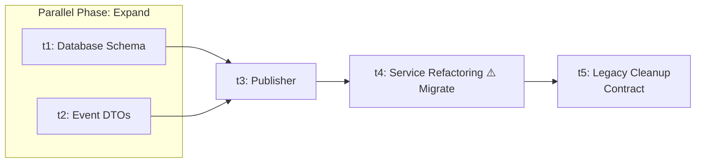

# Implementation Plan: Outbox Migration for User Registration

> **Pipeline Roles**
>
> * 🤖 **Orchestrator:** Reads only the YAML header to build the DAG and launch agents.
> * 🧠 **Weak AI (Agents):** Do not read this manifest. They receive only their assigned `task-X.md` file.
> * 👁️ **Human:** Reviews this document to approve the architectural migration.

---

<b>Architectural Delta (Gap Analysis)</b>

| Responsibility Area | Target State (Spec)         | Current State                     | EMC Phase |
| ------------------- | --------------------------- | --------------------------------- | --------- |
| **Database Schema** | `outbox_events` table added | Only `users` table exists         | Expand    |
| **Events**          | `UserRegisteredEvent` DTO   | Not implemented                   | Expand    |
| **Integration**     | `OutboxEventPublisher`      | Not implemented                   | Expand    |
| **Business Logic**  | Persist event into Outbox   | Synchronous `EmailGateway` call   | Migrate   |
| **Cleanup**         | Direct dependency removed   | Service depends on `EmailGateway` | Contract  |

<b>Execution Graph Topology (Mermaid)</b>

